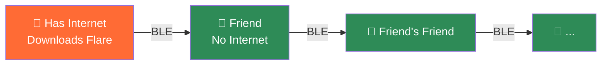
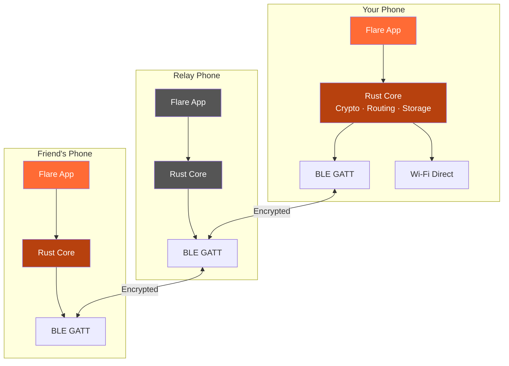
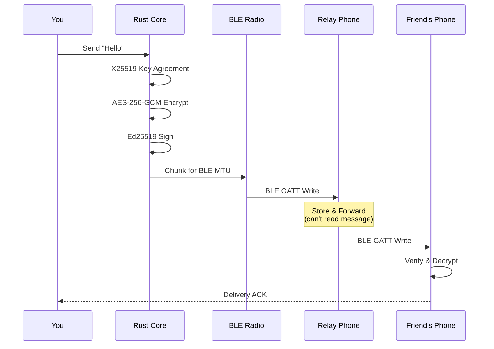

# Flare

**Encrypted messaging that works without internet. Phone to phone, through Bluetooth.**

## What Is Flare?

Flare lets you send encrypted messages to anyone — even when there is no internet, no cell service, and no Wi-Fi. Your messages travel from phone to phone using Bluetooth, hopping through other Flare users until they reach your contact, even if they are dozens of kilometers away.

No servers. No accounts. No phone number required. Just install and start messaging.

## Download & Install

### Android

**[Download the latest APK](https://github.com/zivelo1/Flare/releases/latest)** — look for the `Flare-...-android.apk` file.

**How to install:**
1. Download the `.apk` file on your Android phone (or transfer it from a computer)
2. Open the file — if prompted, allow "Install from unknown sources" for your browser
3. Open Flare — no account, no sign-up, no phone number needed. Just start messaging.

> Requires Android 8.0 or newer. No Google Play Store needed. No internet needed after download.

### iOS
On the roadmap. Android is the priority — in the countries where Flare is needed most (Iran, Syria, Yemen, Sudan, Myanmar, Cuba, Venezuela), Android has 85-98% market share.

### Already have Flare?
You can share it with someone nearby — open **Settings > Share Flare App** in the app. Send the APK file directly via Nearby Share, Bluetooth, WhatsApp, or any messaging app. Or share a download link.

## Who Is This For?

- **People during internet shutdowns** — governments blocking communication during protests or unrest
- **People during natural disasters** — earthquakes, hurricanes, floods that destroy cell towers, in areas where survivors are gathered
- **Journalists and aid workers** — operating in conflict zones where infrastructure is destroyed but people are present
- **Protesters and activists** — communicating in crowded streets when networks are shut down
- **Festival and event attendees** — crowded venues where cell networks are overwhelmed
- **Refugee camps and shelters** — dense populations with no telecom infrastructure
- **Anyone who values privacy** — messages never touch a server, ever

## How It Works


1. **Install Flare** on your phone (Android or iPhone)
2. **Find your friend** — enter a shared phrase you both know, share your identity link via SMS/WhatsApp, or scan each other's QR code when meeting in person
3. **Send messages.** Your messages are encrypted on your phone and hop through other Flare users' phones until they reach your friend. Nobody in between can read them — not even the people whose phones relay them.

Messages can travel across a city or even between cities, as long as there are enough Flare users along the way. The more people using Flare, the further messages can reach.

## Finding Your Contacts Without Internet

Since there are no servers, Flare uses a **Blind Rendezvous** protocol to help you find people you know:

| Method | How It Works | Best For |
|---|---|---|
| **Shared Phrase** | Both you and your friend type the same phrase (a shared memory). Flare matches you securely. | Most situations — secure and private |
| **Share Identity Link** | Send your Flare identity via SMS, WhatsApp, or any app. Your friend taps the link to add you. | Friends who are far away |
| **QR Code** | Scan each other's QR code when you meet in person | Maximum security |
| **Phone Number** | Enter each other's phone numbers. Both must do it. | Convenience (with privacy tradeoff) |
| **Contact Import** | Import your phone contacts to find friends already on Flare | Quick setup |

Your phone number, passphrase, and contacts **never leave your device**. Only a mathematical fingerprint is shared — it cannot be reversed.

## Installing Without Internet

Flare is designed to spread without app stores or internet access:



1. **One person** downloads Flare while they still have internet access (from a website, via Starlink, etc.)
2. **They open Settings > Share Flare App** — the app shares itself via Nearby Share, Bluetooth, or any available channel
3. **A nearby person** receives the APK file and installs it (standard Android sideloading)
4. **The new user opens Flare** and immediately becomes part of the mesh — they can now message AND share the app further
5. **Each new user repeats the process** — Flare spreads person to person, across an entire city or region

The APK includes a SHA-256 hash for integrity verification. The Rust core supports Ed25519 developer signatures and a trusted key store for chain-of-trust verification. On Android, this works via standard APK sideloading.

## Key Features

- **Works offline** — no internet, no Wi-Fi, no cell service needed
- **End-to-end encrypted** — only you and your recipient can read messages
- **No accounts or registration** — no phone number, no email, no sign-up
- **Store and forward** — messages wait on relay phones until they can be delivered, even if it takes days
- **Multi-hop routing** — messages travel through many phones to reach distant recipients
- **Destruction code** — entering a special code permanently wipes all data (messages, contacts, identity) for plausible deniability
- **Biometric lock** — fingerprint/face unlock with code fallback when destruction code is active
- **Phone-to-phone install** — share Flare with others via Bluetooth, no app store needed
- **Open source** — GPLv3, auditable, community-maintained

## Architecture





- **Rust core** — cryptography, mesh routing, Blind Rendezvous discovery, encrypted storage
- **Android** — BLE GATT, Wi-Fi Direct, Material 3 UI
- **iOS** — CoreBluetooth, Multipeer Connectivity, SwiftUI

See [docs/ARCHITECTURE.md](docs/ARCHITECTURE.md) for detailed architecture diagrams including the security model, contact discovery flow, and power management tiers.

## Current Status

**Rust Core** (193 tests passing):
- Ed25519/X25519 identity and key agreement
- AES-256-GCM encryption, HKDF key derivation
- Spray-and-Wait mesh routing with adaptive TTL (48h → 72h → 7d)
- Blind Rendezvous discovery — shared phrase (Argon2id-hardened), phone number (bilateral hash), contact import
- Multi-hop relay with hop count increment (signature excludes mutable fields)
- Neighborhood Bloom Filter for privacy-preserving bridge detection (no GPS)
- Priority message store with 50MB budget and 3-tier eviction
- Delivery ACK and read receipt processing for relay cleanup
- Group messaging, duress PIN, APK sharing protocol
- SQLCipher encrypted database, BLE chunking, UniFFI FFI layer
- **Adaptive power management** — 4-tier duty cycling (High/Balanced/LowPower/UltraLow) with configurable thresholds
- **DEFLATE compression** — payload compression before encryption for BLE bandwidth savings (50-70% for text)
- **Ed25519 APK signing** — developer code signing with trusted key store and key rotation protocol
- **Sender Keys group encryption** — O(1) group messaging via Signal Groups v2 approach with HKDF chain ratchet
- **Route guard** — signature verification, TTL inflation cap, hop count monotonicity, per-sender rate limiting
- **Adaptive spray count** — optimal L = ceil(sqrt(N) × 1.5), auto-adjusts broadcast copies based on network density
- **Neighborhood-aware routing** — bridge peers prioritized in spray targets for faster cluster-crossing delivery
- **Message size tiers** — small (mesh relay), medium (direct preferred), large (direct required) based on payload size and content type
- **Wi-Fi Direct transfer queue** — queue manager for large payloads with retry logic, timeout, and connection state tracking

**Android App** (Kotlin + Jetpack Compose):
- BLE GATT server + client with full mesh routing
- **Wi-Fi Direct transport** — Wi-Fi P2P peer discovery, group formation, TCP socket transfer with length-prefixed protocol
- Material 3 UI: chat bubbles with read receipts, identicon avatars, contacts, network dashboard
- Find Contact screen: shared phrase, identity link sharing, QR code, phone number discovery
- Full message pipeline: encrypt → send → relay → deliver → ACK
- Foreground service, neighborhood detection, ProGuard rules
- **Adaptive power management** — MeshService evaluates battery + network state to dynamically adjust BLE scan/advertise tiers with burst mode scanning
- **BLE chunking** — 5-byte header protocol for large payloads (voice/image), sequential GATT writes with callbacks, chunk reassembly with stale timeout pruning
- **Destruction code** — lock screen with BiometricPrompt (fingerprint/face) + manual code fallback, permanent data wipe (stop service, delete DB, clear prefs, reinitialize)
- **Settings** — destruction code setup, power tier management, storage stats, device info
- **Onboarding** — 4-page introduction flow with skip/next navigation
- **Group messaging UI** — create groups, member selection, group list
- **Splash screen** — animated flame icon with brand gradient
- **Chat animations** — entrance animations on new messages, haptic feedback on send/receive
- **Mesh visualization** — animated Canvas topology showing connected peers with RSSI-based line thickness
- **Voice messages** — hold-to-record (24kbps AAC/16kHz), Base64-encoded audio over mesh, in-chat playback with MediaPlayer
- **Image messages** — camera/gallery photos scaled (400px max) and compressed (JPEG q35), Base64-encoded, rendered in chat bubbles
- **APK sharing** — share the app file via Nearby Share, Bluetooth, or any messaging app (Settings > Share Flare App)
- **KeyExchange protocol** — scanning someone's QR automatically sends your keys back, so they can message you immediately
- **Localization** — 6 languages (Farsi, Arabic, Spanish, Russian, Chinese, Korean) with runtime language switching and confirmation dialog
- **Dark mode** — user-selectable light/dark/system theme toggle in Settings
- **Broadcast messaging** — send a message to all contacts at once
- **Contact rename** — long-press to rename any contact
- **Contact deletion** — long-press to delete a contact and all chat history
- **Profile name** — editable display name in Settings

**iOS App** (Swift + SwiftUI):
- CoreBluetooth BLE central + peripheral with state restoration
- **MultipeerConnectivity transport** — Wi-Fi Direct via Apple's framework with automatic peer discovery, MCSession, deterministic connection deduplication
- SwiftUI screens: chats, contacts, network, find contact, QR (with share link), discovery, settings, groups, onboarding
- Full mesh service: dual transport (BLE + MultipeerConnectivity), rendezvous broadcast, delivery ACK, Wi-Fi Direct queue processing
- **Identicon avatars** — deterministic colors from SHA-256 hash of device ID
- **Settings** — duress PIN, power management, storage stats
- **Onboarding** — 4-page introduction with @AppStorage persistence
- **Splash screen** — animated FlameShape icon with brand gradient
- **Chat animations** — spring transitions, haptic feedback via centralized HapticManager
- **Mesh visualization** — animated Canvas topology with pulsing peer connections
- **Voice recording** — hold-to-record with AVAudioRecorder, live waveform display
- **Image capture** — UIImagePickerController with preview sheet
- iOS ARM cross-compilation verified — device testing deferred (Android-first strategy based on target market analysis)

See [docs/PROJECT_STATUS.md](docs/PROJECT_STATUS.md) for detailed progress.

## Building

### Prerequisites
- Rust 1.70+ (`curl --proto '=https' --tlsv1.2 -sSf https://sh.rustup.rs | sh`)
- Android Studio (for Android app)
- Xcode 15+ (for iOS app, macOS only)

### Rust Core
```bash
cd flare-core
cargo build
cargo test
```

## Documentation

- [Architecture Diagrams](docs/ARCHITECTURE.md) — visual system overview, message flow, security model
- [Architecture Decisions](docs/ARCHITECTURE_DECISIONS.md) — ADR log
- [Development Setup](docs/DEVELOPMENT_SETUP.md) — build instructions
- [Project Status](docs/PROJECT_STATUS.md) — current progress

## Security

Flare uses established, audited cryptographic primitives:
- **Ed25519** — digital signatures (identity, message authentication)
- **X25519** — Diffie-Hellman key agreement
- **AES-256-GCM** — authenticated encryption
- **HKDF-SHA256** — key derivation
- **Argon2id** — passphrase-based key derivation (database encryption + rendezvous tokens)
- **SQLCipher** — encrypted SQLite for data at rest
- **Sender Keys** — O(1) group encryption with chain ratchet (Signal Groups v2)
- **DEFLATE** — payload compression before encryption for BLE bandwidth efficiency

**Privacy by design:**
- No servers, no accounts, no tracking
- Messages never touch the internet
- Phone numbers and passphrases never leave your device
- Rendezvous tokens rotate weekly and cannot be reversed
- Destruction code permanently wipes all data if you are coerced

## License

GNU General Public License v3.0 — see [LICENSE](LICENSE) for details.
