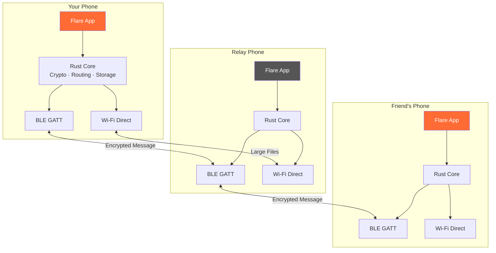
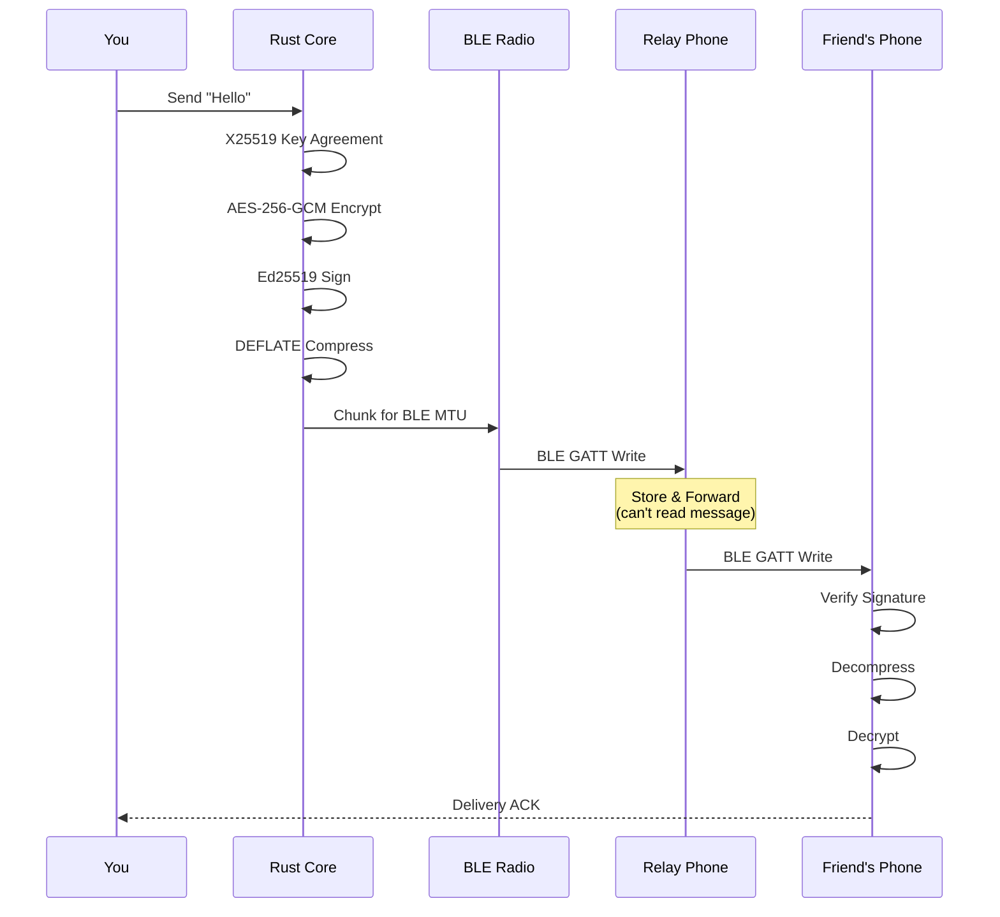
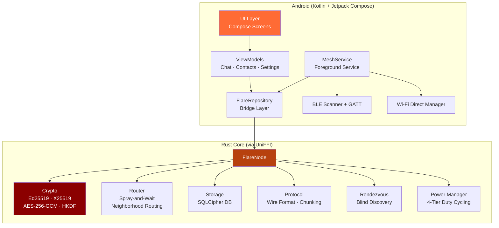
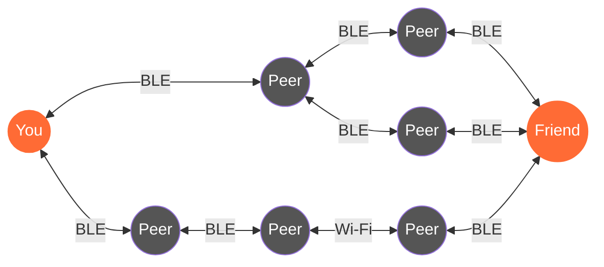
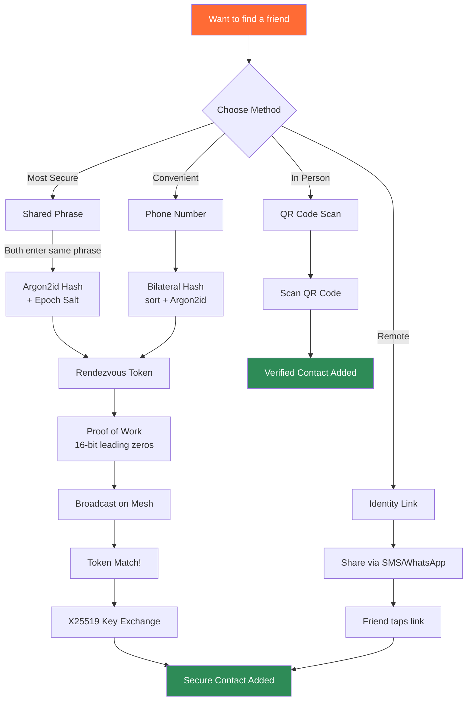
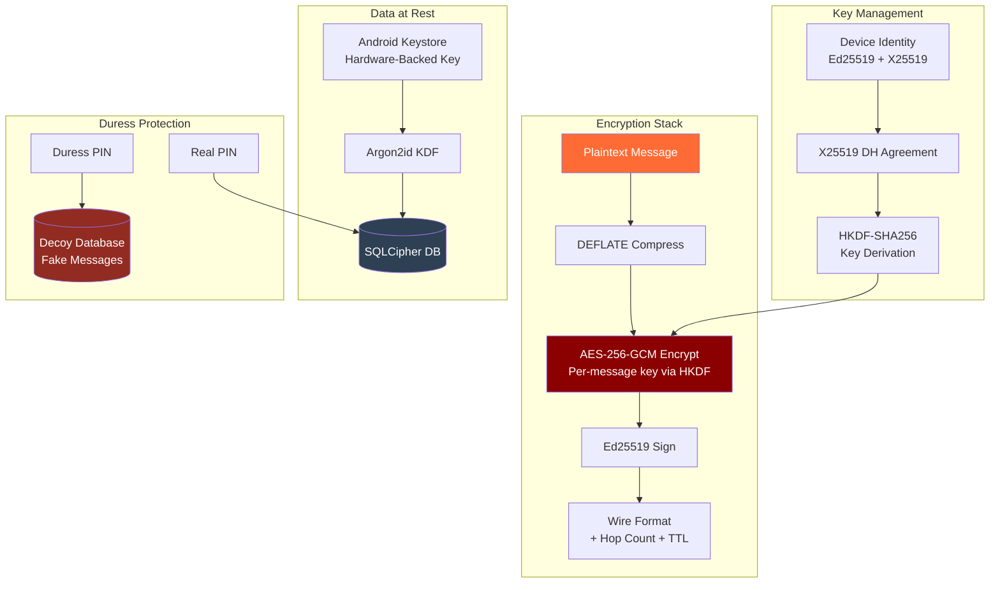
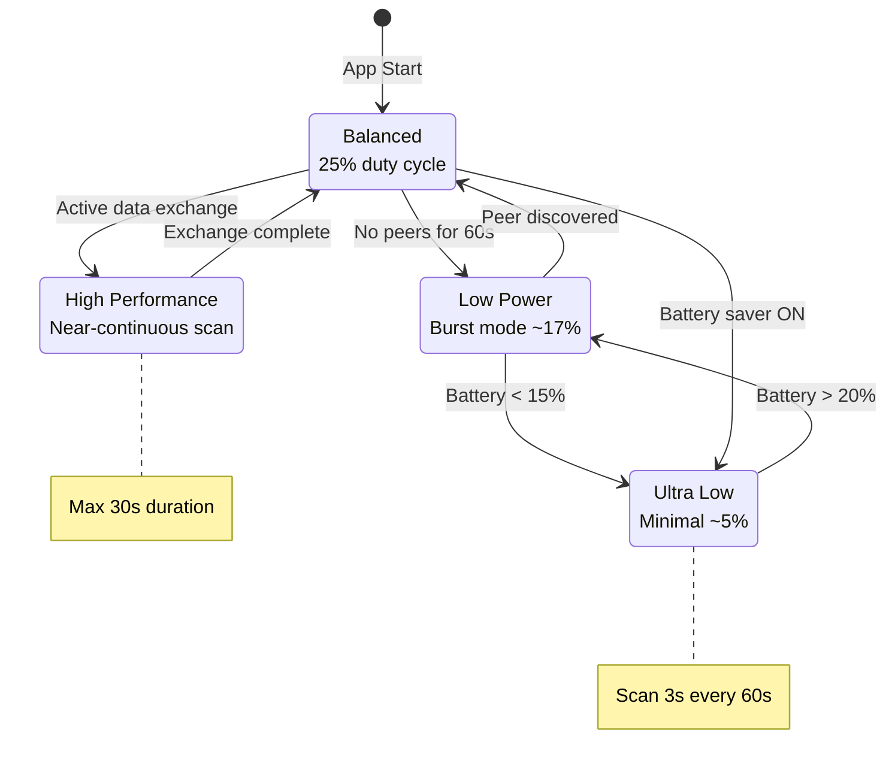

# Flare Architecture

## System Overview

## Message Flow

## Software Architecture

## Mesh Network Topology

## Contact Discovery (Blind Rendezvous)

## Security Model

## Power Management Tiers

